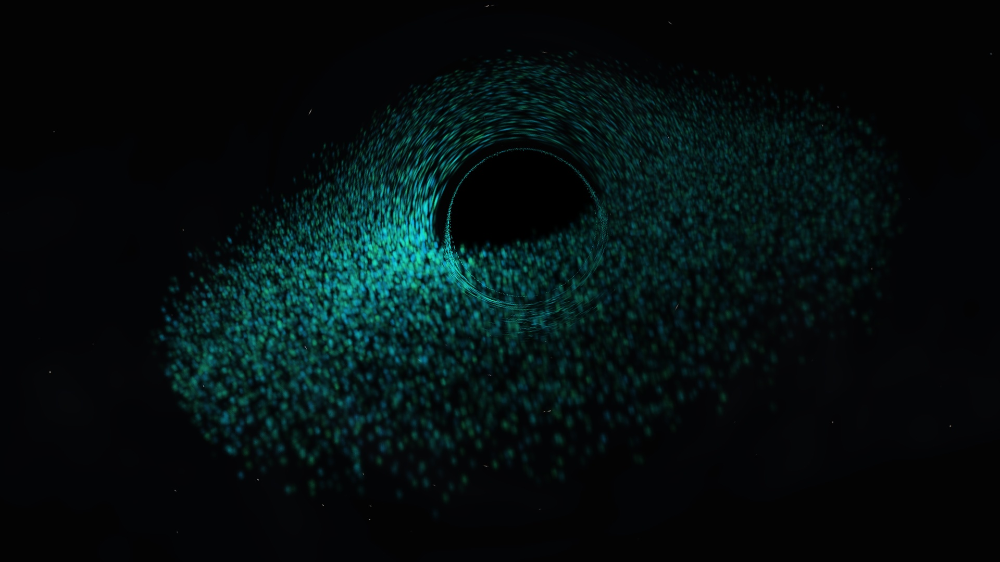

# Gravity Visualizer

A black hole audio visualizer for Wallpaper Engine and the browser.

[Browser demo](#) · [Video demo](#)

## Details

Built with JavaScript and WebGL2. Particle orbits and gravitational lensing use the Kerr metric, with approximate volume rendering for the glowing disk. Supports live system audio in Wallpaper Engine and local music in the browser.

[Physics](docs/physics.md) · [Wallpaper Engine setup](docs/handoff.md) · [Music credit](assets/CREDITS.md)
