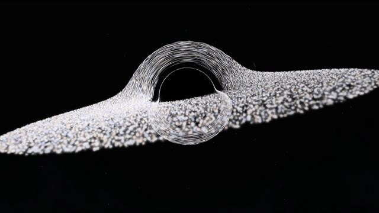
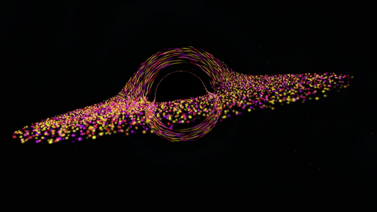
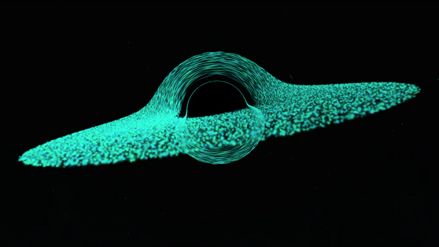
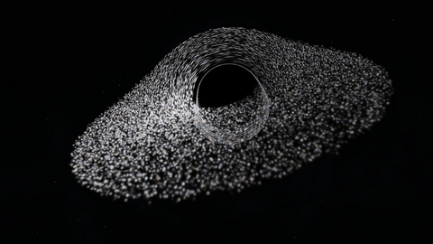

# Gravity Visualizer

A black hole audio visualizer for Wallpaper Engine and the browser.

[Wallpaper](https://steamcommunity.com/sharedfiles/filedetails/?id=3802507065) [Browser demo](https://colbyjack1134.github.io/gravityVisualizer/) [Video demo](https://youtu.be/2KeiIyUf-os)

Customizable

## Details

Built with JavaScript and WebGL2. Particle orbits and gravitational lensing use the Kerr metric, with approximate volume rendering for the glowing disk. Supports live system audio in Wallpaper Engine, plus local music and browser-supported audio sharing on the web.

## Credits

Demo music: [Chill Day by LAKEY INSPIRED](assets/CREDITS.md), licensed under [CC BY-SA 3.0](https://creativecommons.org/licenses/by-sa/3.0/).
